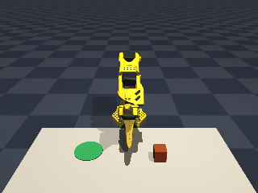
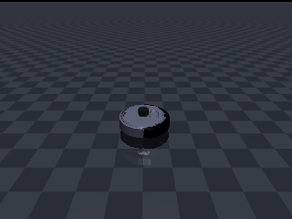
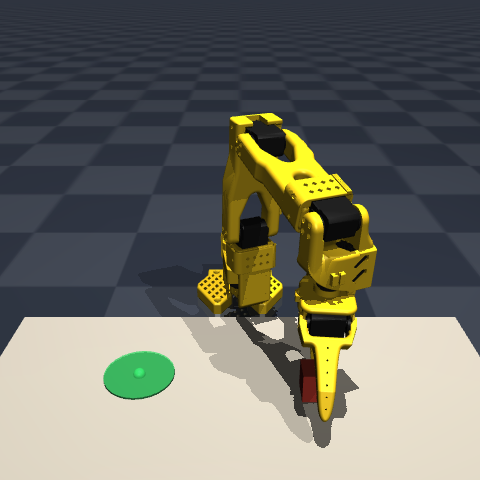
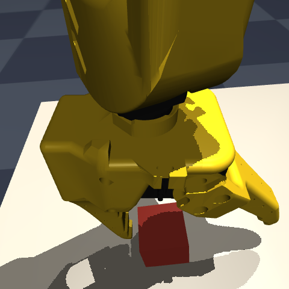
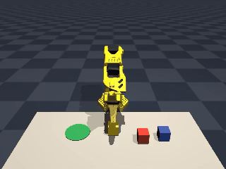
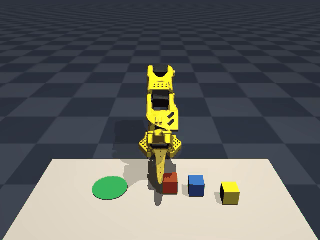

# PhysAI Robot Starter

Open-source starter kit for embodied AI and robotics. It connects classical
robot control, MuJoCo simulation, ROS2 interfaces, and later data-driven
policies through stable robot, task, observation, and action contracts.

The project is currently in **Phase 1: Classical Foundation and ROS2
Contract**. The supported foundation is an SO-101 arm and a TurtleBot4
differential-drive base in MuJoCo. The immediate goal is reliable deterministic
control and the first ROS2 integration, not a completed VLM or VLA stack.

The shortest Phase 1 path is model-free: run the scripted SO-101
pick-and-place baseline, inspect the contracts, then validate the ROS2 bridge
when that integration is available.

<p align="center">
  
</p>

<p align="center">
  <em>The Phase 1 baseline: <code>python scripts/run_sim.py</code>, one scripted
  pick-and-place episode, no model or API key involved.</em>
</p>

Every clip and screenshot below is a real simulator rollout at a fixed seed.
Regenerate them all with `python scripts/render_docs_media.py`.

## Requirements

- Ubuntu 24.04 LTS
- Python 3.12
- ROS2 Jazzy for ROS2 integration and hardware workflows
- A virtual environment

Ubuntu 24.04 and Python 3.12 are the supported baseline because ROS2 Jazzy
targets that platform. The direct MuJoCo simulator can run without a ROS2
installation, but the Docker workflow includes ROS2 Jazzy for integration
testing. VLM and VLA workflows need more memory; CUDA is optional.

## Install

Create the environment and install the base package from the project root:

```bash
python3.12 -m venv .venv
source .venv/bin/activate
python -m pip install --upgrade pip
python -m pip install -e .
```

The base install contains MuJoCo, NumPy, image/video support, and YAML
configuration. `requirements.txt` mirrors this Phase 1 baseline and does not
install ROS2, VLM, or VLA dependencies. Use the optional extras below when
those later-phase features are needed.

Install development tools and run the test suite with:

```bash
python -m pip install -e ".[dev]"
PYTEST_DISABLE_PLUGIN_AUTOLOAD=1 python -m pytest tests/ -q
```

## Quick start

Fetch the SO-101 description and run one scripted pick-and-place episode:

```bash
python scripts/fetch_assets.py --robot so101
python scripts/run_sim.py
```

The command writes a video and evaluation output to `outputs/`. Open the
interactive MuJoCo viewer after the headless run succeeds:

```bash
python scripts/run_sim.py --viewer
```

Run the same task from the checked-in YAML configuration:

```bash
python scripts/run_sim.py --config configs/task_pick_place.yaml
```

Use `--seed`, `--max-steps`, and `--camera-size` to override configuration.
The shared simulation seed and domain-randomization switch come from
`configs/sim_config.yaml`, selected by `--sim-config` and defaulting to that
file. Randomization must remain disabled until its Phase 1E engine is added.
For image-conditioned policies, keep `--camera-size` square and match the
training resolution, such as `128` or `224`.

## Current Phase 1 scope

Two embodiments are supported, and they do not share an action space: the arm
takes joint positions, the base takes a twist.

| SO-101 | TurtleBot4 |
| --- | --- |
|  |  |
| Scripted pick-and-place, joint-position control | Constant forward and yaw twist, differential drive |

| Robot | Current baseline | Phase 1 direction |
| --- | --- | --- |
| SO-101 | Deterministic MuJoCo pick-and-place with scripted control | ROS2 joint, gripper, camera, and TF bridge |
| TurtleBot4 | Deterministic MuJoCo base-velocity smoke test | ROS2 `/cmd_vel`, odometry, TF, and Nav2 foundation |

The TurtleBot4 path is currently a generic control smoke test, which is what
its clip above shows; navigation is a Phase 1 deliverable and is not
implemented yet. The SO-101 ROS2 bridge, TurtleBot4 navigation path, and
controlled domain randomization are also part of the active Phase 1 roadmap.
Direct MuJoCo remains the fast local path and does not replace ROS2
integration validation.

The planned progression is:

```text
Phase 1  Classical foundation + ROS2 contract
    -> Phase 2  Vision-based motor skills with LeRobot
    -> Phase 3  High-level VLM orchestration
    -> Phase 4  End-to-end VLA policy
```

Phase 2 and later are future direction. Their current scripts and adapters are
experimental seams around the Phase 1 contracts, not completion claims for
those phases. See [Roadmap](ROADMAP.md) for the scope and definition of done
for each phase.

## Phase 1 workflows

### What a policy observes

The SO-101 publishes two camera views per step alongside joint state. Both are
recorded into every demonstration and are the only inputs an image-conditioned
policy receives; the scripted expert ignores them and reads cube pose straight
from the simulator instead.

| `front` | `wrist` |
| --- | --- |
|  |  |
| Fixed world view: arm, cube, and target pad | Gripper-mounted, looking down the approach axis |

Both frames come from `observation.images` on the same timestep, captured here
as the jaws close on the cube.

### Evaluate and replay

Evaluate the scripted expert over multiple seeds:

```bash
python scripts/eval_policy.py --policy scripted --episodes 20
```

Record successful demonstrations, then replay their actions through the
simulator:

```bash
python scripts/collect_demos.py --episodes 50 --out data/pickplace_v1
python scripts/eval_policy.py --policy replay --dataset data/pickplace_v1
```

The sorting variant records three cubes and chooses a target color per episode:

```bash
python scripts/collect_demos.py --sorting --episodes 50 --out data/sorting_v1
```

<p align="center">
  
</p>

The scripted expert reaches roughly 72% on this variant against about 95% on
the single-cube task, because three cubes on the same table leave less grasp
clearance.

Failed demonstrations are discarded by default. Add `--keep-failures` when
you are analyzing failure cases.

### Development inspection

```bash
python scripts/workspace_map.py
python scripts/show_ros2_contract.py
python scripts/teleop_keyboard.py
python scripts/export_scene.py --out outputs/scene_pick_place.xml
python scripts/render_docs_media.py --only so101
```

`teleop_keyboard.py` opens the MuJoCo viewer and exercises Cartesian jogging.
`export_scene.py` writes a composed MJCF file; its relative mesh paths resolve
from the SO-101 asset directory. `render_docs_media.py` re-renders the clips
and screenshots this README embeds, which is also a quick way to eyeball
whether a scene or camera change looks right.

## Later-phase experiments

The repository contains early data and model workflows so they can be tested
against the shared contracts. They belong to the roadmap's later phases and
are not required for the current Phase 1 baseline.

### Phase 2: LeRobot and ACT

Collect demonstrations and fine-tune an ACT policy after installing the VLA
extra:

```bash
python -m pip install -e ".[vla]"
python scripts/train_act.py --dataset data/pickplace_v1 --steps 4000
python scripts/eval_policy.py --policy lerobot \
  --checkpoint outputs/act_ckpt --camera-size 128
```

The training script stores the checkpoint and metadata under
`outputs/act_ckpt` by default. Use the same square image size during training
and evaluation to avoid an image distribution mismatch.

### Phase 3: VLM planning

Check the planner-to-simulator path without a model or API key:

```bash
python scripts/plan_task.py --planner scripted --dry-run
```

SmolVLM produces visual sub-goals from simulated camera images. Install its
extra and download the model before running it:

```bash
python -m pip install -e ".[smolvlm]"
python scripts/download_models.py --model smolvlm
python scripts/plan_task.py --planner smolvlm --dry-run
```

Use `--instruction`, `--save-plan`, and `--save-frames` to customize or
inspect a planning run. A planner proposes sub-goals; it is not the low-level
motor policy.

The distinction is visible on the sorting scene. Both runs below start from an
identical cube layout and differ only in the instruction text, and the planner
grounds the color word onto a different cube each time:

| "put the **red** cube on the pad" | "put the **blue** cube on the pad" |
| --- | --- |
|  |  |

Sub-goal selection is where language grounding belongs in this architecture.
The ACT policy in Phase 2 has no text input at all, so the same instruction
swap leaves its behavior byte-for-byte identical.

## Python API

`physai.runtime.create_runtime` composes a registered robot, task, policy, and
safety boundary:

```python
from physai.runtime import create_runtime

runtime = create_runtime("so101", task_name="pick_place")
observation = runtime.reset(seed=0)
try:
    # Pass actions from a policy or resolver here.
    pass
finally:
    runtime.close()
```

For the multi-object sorting task, select the matching scene explicitly:

```python
runtime = create_runtime(
    "so101",
    scene_name="sorting_minimal",
    task_name="sorting",
)
```

## Optional models and APIs

Model snapshots are downloaded into the ignored local `models/` directory.
Install the extra for the workflow you intend to use:

```bash
# SmolVLM planner
python -m pip install -e ".[smolvlm]"
python scripts/download_models.py --model smolvlm

# LeRobot/VLA support
python -m pip install -e ".[vla]"
python scripts/download_models.py --model smolvla
python scripts/download_models.py --model turbovla
```

The downloader also accepts a custom Hugging Face repository:

```bash
python -m pip install huggingface-hub
python scripts/download_models.py --repo org/model --name my_model
```

Copy `.env.example` to `.env` when using gated or private Hugging Face models,
or when the anonymous download limit is reached. Claude is an optional cloud
planner; install its extra and provide `ANTHROPIC_API_KEY` in the environment:

```bash
python -m pip install -e ".[vlm]"
export ANTHROPIC_API_KEY="your-key"
python scripts/plan_task.py --planner claude --dry-run
```

Do not commit `.env`, credentials, checkpoints, or downloaded assets.

## ROS2 Jazzy

ROS2 integration targets Jazzy on Ubuntu 24.04. The repository's Docker image
installs `ros-jazzy-ros-base`, `ros-jazzy-rviz2`, `ros-jazzy-ros2-control`, and
`ros-jazzy-ros2-controllers`, then sources `/opt/ros/jazzy/setup.bash` when the
container starts.

For a host installation, follow the official
[ROS2 Jazzy Ubuntu installation guide](https://docs.ros.org/en/jazzy/Installation/Ubuntu-Install-Debs.html)
before using ROS2 tools. Inspect the message-shaped contract without ROS2 by
running:

```bash
python scripts/show_ros2_contract.py
```

The first synchronous MuJoCo bridge core is available as
`physai.bridge.MuJoCoROSBridge`. It uses an injected transport, publishes
joint states and rendered camera images, accepts joint trajectory and gripper
commands, and applies the shared safety gate. A real `rclpy` node can be
adapted with `RclpyTransport`; TF, CameraInfo, and TurtleBot4 mobile-base
topics remain Phase 1 work.

## Docker

The helper chooses the GPU image by default. Select CPU mode while building on
machines without the NVIDIA runtime:

```bash
python docker/container.py build --cpu
python docker/container.py start
python docker/container.py shell
python docker/container.py stop
```

Use `build --gpu` for the CUDA image and `build --no-cache` to rebuild without
cached layers. Rebuild to switch between GPU and CPU modes.

## Generated files and licenses

The following local directories are ignored by Git and Docker:

- `assets/`: downloaded robot descriptions and meshes
- `data/`: recorded demonstrations
- `models/`: local model snapshots
- `outputs/`: videos, plans, checkpoints, and evaluation artifacts

The PhysAI Robot Starter source code is licensed under the Apache License 2.0.
Downloaded robot assets, model checkpoints, and Python dependencies retain
their original licenses. See [THIRD_PARTY_NOTICES.md](THIRD_PARTY_NOTICES.md)
before redistributing downloaded artifacts. The TurtleBot4 model attribution
is also documented there.

## Documentation

- [Architecture](docs/ARCHITECTURE.md): runtime composition, module ownership,
  contracts, and extension boundaries.
- [Contributing](CONTRIBUTING.md): contribution workflow and commit format.
- [Third-party notices](THIRD_PARTY_NOTICES.md): asset and model sources,
  attribution, and license status.
- [Agent guide](AGENTS.md): rules for coding agents working in this repository.
- [Roadmap](ROADMAP.md): planned work and migration direction.

## Troubleshooting

Run commands from the project root with `.venv` activated. If robot files are
missing, fetch them again:

```bash
python scripts/fetch_assets.py
```

For a simulator-only check, use `--policy constant` or the default scripted
SO-101 policy. Neither requires SmolVLM, Claude, a model download, or an API
key. If video encoding is unavailable, the simulator falls back to a GIF;
installing `imageio-ffmpeg` enables MP4 output.
