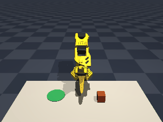
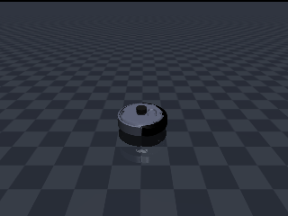
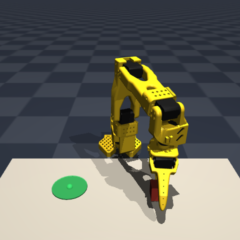
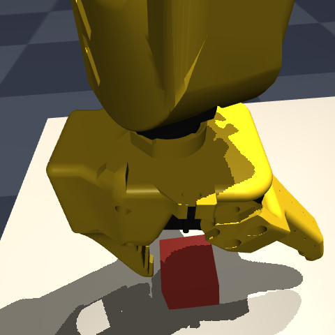
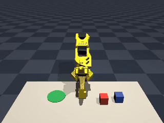

# PhysAI Robot Starter

Open-source starter kit for embodied AI and robotics. It connects classical robot control,
MuJoCo simulation, ROS2 interfaces and later data-driven policies through stable robot, task,
observation and action contracts.

**Status:** Phase 1 (classical foundation and ROS2 contract) and the training bridge are
complete for the supported SO-101 arm and TurtleBot4 base in MuJoCo. Phase 2A, the classical
vision baseline, is in progress. See the [Roadmap](ROADMAP.md) for scope and definitions of
done.

<p align="center">
  
</p>

<p align="center">
  <em>The Phase 1 baseline: <code>python scripts/run_sim.py</code>, one scripted
  pick-and-place episode, no model or API key involved.</em>
</p>

Every clip and screenshot in the docs is a real simulator rollout at a fixed seed; regenerate
them with `python scripts/render_docs_media.py`.

## Requirements

Ubuntu 24.04 LTS, Python 3.12 and a virtual environment; ROS2 Jazzy for ROS2 integration (the
Docker image includes it). That platform is the baseline because Jazzy targets it. The direct
MuJoCo simulator runs without ROS2, VLM and VLA workflows need more memory, and CUDA is
optional.

## Install

Install `uv` for your platform, then from the project root:

```bash
curl -LsSf https://astral.sh/uv/install.sh | sh
uv sync --extra training
```

The base install holds MuJoCo, NumPy, image and video support, YAML configuration, the browser
viewer (FastAPI/uvicorn, `--serve`) and the dev tooling (pytest, ruff, import-linter): this is a
repository you work in directly, not a library. Extras: `training` (Gymnasium, PyTorch and
LeRobot for ACT) and `isaac` ([Isaac Sim](#isaac-sim-optional-local-gpu-only)); they combine in one
environment ([ADR 18](docs/adr/simulators.md#adr-18-one-environment-for-isaac-sim-and-lerobot)).
Run the tests with:

```bash
PYTEST_DISABLE_PLUGIN_AUTOLOAD=1 uv run python -m pytest tests/ -q
```

## Quick start

Fetch the SO-101 description and run one scripted pick-and-place episode:

```bash
uv run python scripts/fetch_assets.py --robot so101
uv run python scripts/run_sim.py
```

It runs headlessly and writes evaluation output to `outputs/`; add `--video` to record the
episode. A run is described by a session manifest
(`--manifest configs/manifests/so101_single_cube_fixed_place.yaml` is the checked-in task); its
`simulation` block holds the seed, camera resolution and the domain-randomization switch (off for
the deterministic baseline), and `--seed`, `--max-steps` and `--camera-res` override it. The
camera resolution defaults to 320 x 240 for every simulator, script and test, so results stay
comparable.

### Interactive viewer

Start the host with `--serve` and open the browser client (Three.js, configurable camera panels,
per-policy debug overlays):

```bash
MUJOCO_GL=egl uv run python scripts/run_sim.py --robot so101 --serve
MUJOCO_GL=egl uv run python scripts/run_web.py --connect http://127.0.0.1:8000
MUJOCO_GL=egl uv run python scripts/run_sim.py --manifest configs/manifests/heterogeneous_world.yaml --serve
```

Serve mode holds the current pose until you pass `--policy` (for example `--policy scripted`);
add `--dataset data/web_session` to record episodes from the browser. Headless `run_sim.py` and `eval_policy.py` take `--record` (like `--video`: `outputs/recordings/<sim>_<robot>_<policy>_seed<seed>.npz` + `.json`; `--out` moves `videos/` and `recordings/`, `--name` replaces the prefix) it saves every input per step (cameras, joints, `extras.*` such as grip force and visual-servo detections) for later analysis. `--viewer` opens
MuJoCo's own desktop window instead of, or alongside, `--serve`
([ADR 4](docs/adr/web-host.md#adr-4---viewer-is-mujocos-own-viewer-frozen-in-scope)). The third
command puts several robots in one scene, model and clock. The
[Web Viewer runbook](docs/WEB_VIEWER_RUNBOOK.md) covers controls, recording, playback and
troubleshooting (including WSL2 and dual-GPU Windows).

## Supported robots

The two embodiments do not share an action space: the arm takes joint positions, the base takes a
twist. Controlled domain randomization is available behind the configuration toggle (off by
default), and direct MuJoCo is the fast local path, not a replacement for ROS2 validation.

| SO-101 | TurtleBot4 |
| --- | --- |
|  |  |
| Scripted pick-and-place, joint-position control, ROS2 joint/gripper/camera/TF bridge, IK safety validation | Deterministic navigation, ROS2/Nav2 acceptance path, obstacle detection, collision telemetry |

The SO-101 publishes two camera views per step; both are recorded into every demonstration and are
the only inputs an image-conditioned policy receives (the scripted expert reads cube pose from the
simulator instead):

| `front` | `wrist` |
| --- | --- |
|  |  |

## Workflows

```bash
uv run python scripts/eval_policy.py --policy scripted --episodes 100
uv run python scripts/collect_demos.py --episodes 50 --dataset data/pickplace_v1
uv run python scripts/eval_policy.py --policy replay --dataset data/pickplace_v1
```

| Script | Use it to |
| --- | --- |
| `run_sim.py` | run and look at one session: quick check, viewer or web host, video, recording |
| `eval_policy.py` | measure a policy over N seeds and compare the numbers (`--json`) |
| `collect_demos.py` | make a dataset with the scripted expert |

Both `run_sim.py` and `eval_policy.py` run the session in a manifest and stop an episode the
same way; `eval_policy.py` takes difficulty flags and reports a success rate
([script roles](docs/ARCHITECTURE.md#script-roles)). Episode length (600 steps) comes from the
manifest (`--max-steps` overrides it).

Add `--sorting` to `eval_policy.py` and `collect_demos.py` for the three-cube sorting task, and
`--keep-failures` to keep failed demonstrations (discarded by default). Use at least 100 seeds:
20 cannot resolve a policy's reliability. Measured success rates are in the
[results table](research/scripted_experts/README.md#results).

<p align="center">
  
</p>

Inspection helpers: `scripts/workspace_map.py`, `scripts/show_ros2_contract.py`,
`scripts/teleop_keyboard.py` (MuJoCo viewer with Cartesian jogging),
`scripts/export_scene.py --out outputs/scene_single_cube_fixed_place.xml` (a composed MJCF whose
relative mesh paths resolve from the SO-101 asset directory) and
`scripts/render_docs_media.py --only so101`.

Later-phase experiments live under `research/`, and each topic's README is its runbook:
[imitation learning](research/imitation_learning/README.md),
[classical control](research/classical_control/README.md),
[scripted experts](research/scripted_experts/README.md). Copy `.env.example` to `.env` for gated
Hugging Face models, and never commit `.env`, credentials, checkpoints or downloaded assets.

## ROS2 Jazzy

ROS2 integration targets Jazzy on Ubuntu 24.04; the Docker image installs `ros-jazzy-ros-base`,
`ros-jazzy-rviz2`, `ros-jazzy-ros2-control` and `ros-jazzy-ros2-controllers` (for a host install
follow the [official guide](https://docs.ros.org/en/jazzy/Installation/Ubuntu-Install-Debs.html)).
`uv run python scripts/show_ros2_contract.py` prints the message-shaped contract without ROS2.
`physai.bridge.MuJoCoROSBridge` is the synchronous bridge core (injected transport, joint states
and camera images out, joint trajectory and gripper commands in, shared safety gate); the `rclpy`
nodes add TF and CameraInfo for SO-101 and odometry, scans and TF for TurtleBot4. The acceptance
paths are in the [robot runbooks](docs/ROBOT_RUNBOOKS.md).

## Isaac Sim (optional, local GPU only)

A second engine for measuring a MuJoCo-tuned policy's sim-to-sim gap, verified on Isaac Sim 6.1.0.0
(RTX 3060). It installs into this project's own `.venv`
([ADR 16](docs/adr/simulators.md#adr-16-isaacsim-as-a-project-extra-not-a-separate-venv)).
`OMNI_KIT_ACCEPT_EULA=YES` accepts the NVIDIA Omniverse EULA non-interactively; set it yourself,
nothing here does it for you.

```bash
uv sync --extra isaac --extra training
OMNI_KIT_ACCEPT_EULA=YES uv run python scripts/run_sim.py --manifest configs/manifests/so101_single_cube_fixed_place.yaml --sim isaac --policy visual_servo --video
OMNI_KIT_ACCEPT_EULA=YES uv run python scripts/eval_policy.py --sim isaac --policy visual_servo --episodes 100 --json outputs/isaac.json
uv run python scripts/compare_evaluations.py outputs/mujoco.json outputs/isaac.json
```

The same manifest runs on both engines (a manifest's `simulator: isaac` field or
`create_robot(..., simulator="isaac")` selects Isaac). Isaac supports single-cube scenes with a
fixed target, a lighting scale and camera jitter, and observation-only policies (`visual_servo`,
`constant`, `lerobot`); `--viewer` is MuJoCo-only and `--serve` shows a mirrored scene
([ADR 15](docs/adr/simulators.md#adr-15-simulator-engine-selection)). Each Isaac run must be its
own process, and `pytest -m isaac` runs one test file at a time. Isaac sometimes starts without
drawing the robot; the env detects it (`robot_is_rendered()`) and stops, so run long evaluations
in shards of ten seeds and repeat one that aborts
([sharded evaluation](research/classical_control/README.md#isaac-sim)).

## Python API

`physai.runtime.create_runtime` composes a registered robot, task, policy and safety boundary:

```python
from physai.runtime import create_runtime

runtime = create_runtime("so101", task_name="single_cube_fixed_place")
observation = runtime.reset(seed=0)
try:
    ...  # pass actions from a policy or resolver here
finally:
    runtime.close()
```

For the sorting task select its scene explicitly:
`create_runtime("so101", scene_name="sorting_minimal", task_name="sorting")`.

## Docker

```bash
python docker/container.py build --cpu    # or --gpu for the CUDA image
python docker/container.py start
python docker/container.py shell
python docker/container.py stop
```

The helper builds the GPU image by default; `--no-cache` rebuilds without cached layers, and you
rebuild to switch between GPU and CPU.

## Generated files and licenses

`assets/` (downloaded robot descriptions), `data/` (demonstrations) and `outputs/` (videos, plans,
checkpoints, evaluation artifacts) are ignored by Git and Docker. The source is Apache License 2.0;
downloaded robot assets, model checkpoints and Python dependencies keep their own licenses, so see
[THIRD_PARTY_NOTICES.md](THIRD_PARTY_NOTICES.md) before redistributing downloaded artifacts.

## Documentation

- [Architecture](docs/ARCHITECTURE.md): module ownership, contracts and extension boundaries.
- Runbooks: [robots (SO-101, TurtleBot4)](docs/ROBOT_RUNBOOKS.md) and the
  [web viewer](docs/WEB_VIEWER_RUNBOOK.md). Manifests are in `configs/manifests/`, Nav2 profiles
  in `configs/nav2/<robot>/`, maps in `configs/maps/<environment>/`.
- [Architecture decisions](docs/adr/README.md): the decisions behind the frozen design.
- [Research](research/README.md): per-topic runbooks and findings.
- [Contributing](CONTRIBUTING.md), [agent guide](AGENTS.md) and [roadmap](ROADMAP.md).
- [Third-party notices](THIRD_PARTY_NOTICES.md).

## Troubleshooting

Run commands from the project root with `uv run`. If robot files are missing, run
`uv run python scripts/fetch_assets.py` again. For a simulator-only check use `--policy constant`
or the default scripted SO-101 policy; viewer and serve modes stay idle unless a policy is
supplied. None of these workflows needs a model download or an API key. Without an H.264 encoder
the simulator falls back to a GIF; install `imageio-ffmpeg` for MP4.
