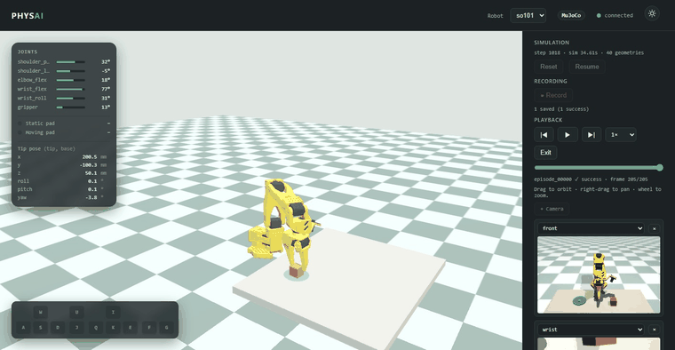
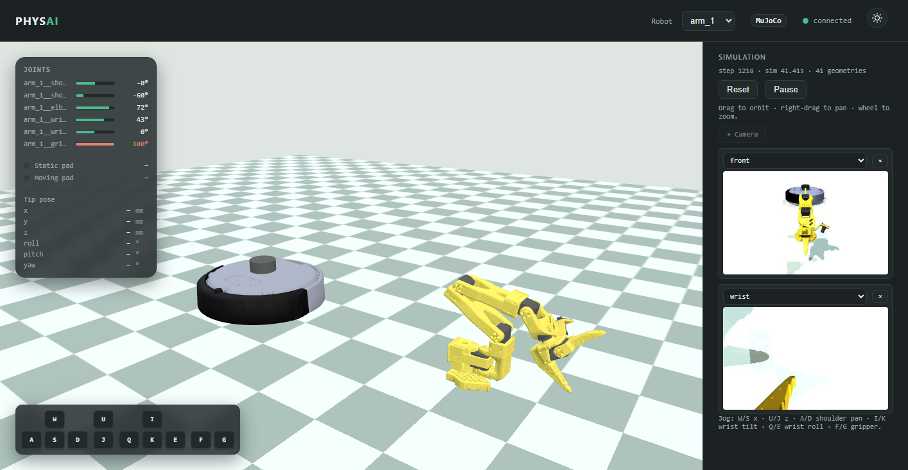

# PhysAI Robot Starter

An open-source platform for embodied AI and robotics. It puts robots, tasks, policies and
simulators behind stable observation and action contracts, so the same policy runs on a
different robot, simulator or transport without rewriting it. Run a session from one YAML
manifest, watch and drive it in the browser, and plug your own robot, task or policy in with
one file and one registration call.

<p align="center">
  
</p>

<p align="center">
  <em>The browser viewer started by <code>run_sim.py --serve</code>, replaying a recorded
  scripted pick-and-place episode: 3D scene, joints, tip pose and live camera panels.</em>
</p>

- **Contracts, not glue.** `Observation`, `Action`, `RobotSpec` capabilities and a safety gate
  sit between every policy and every robot; adding a robot is a descriptor, not a fork.
- **Several robots, one world.** Heterogeneous robots (an arm and a mobile base today) share
  one scene, clock and viewer.
- **Simulator and transport are independent.** MuJoCo by default, Isaac Sim optionally; direct
  in-process calls for speed, ROS2 Jazzy topics for integration.
- **Reproducible runs.** Seeds, scenes and settings live in a session manifest; evaluation,
  demonstration collection and video recording share one episode loop.
- **Research stays outside the core.** Scripted experts, visual servoing and ACT imitation
  learning live in [`research/`](research/README.md) and register themselves; core never
  imports them.

<p align="center">
  
</p>

**Status:** simulation only. See the [roadmap](ROADMAP.md) for scope.

## Install

Ubuntu 24.04 LTS and Python 3.12 are the baseline (ROS2 Jazzy targets it; the Docker image
includes ROS2). The direct simulator runs without ROS2, and CUDA is optional. Install
[`uv`](https://docs.astral.sh/uv/), then from the project root:

```bash
uv sync --extra training      # base: MuJoCo, viewer, tests; training adds PyTorch + LeRobot
PYTEST_DISABLE_PLUGIN_AUTOLOAD=1 uv run python -m pytest tests/ -q
```

## Quick start

```bash
uv run python scripts/fetch_assets.py --robot so101
uv run python scripts/run_sim.py                                 # headless scripted pick-and-place; add --video
MUJOCO_GL=egl uv run python scripts/run_sim.py --serve --policy scripted   # then open http://127.0.0.1:8000
MUJOCO_GL=egl uv run python scripts/run_sim.py --manifest configs/manifests/heterogeneous_world.yaml --serve
```

A run is described by a manifest in `configs/manifests/` (seed, scene, robots, policy,
simulator); `--seed`, `--max-steps` and `--camera-res` override it. Without `--policy`, serve
mode holds the current pose so you can jog the robot from the keyboard. The
[web viewer runbook](docs/WEB_VIEWER_RUNBOOK.md) covers controls, recording and playback,
and troubleshooting (including WSL2 and dual-GPU Windows).

| Script | Use it to |
| --- | --- |
| `run_sim.py` | run and look at one session: headless check, desktop `--viewer`, browser `--serve`, `--video`, `--record` |
| `eval_policy.py` | measure a policy over N seeds (`--json`, difficulty flags); use at least 100 seeds |
| `collect_demos.py` | make a dataset with the scripted expert |

Every script documents its flags with `--help`. Other tools: `fetch_assets.py`,
`workspace_map.py`, `plot_workspace.py`, `show_ros2_contract.py`, `teleop_keyboard.py`, `export_scene.py`.

## Supported robots

| Robot | Action space | What it has |
| --- | --- | --- |
| SO-101 arm | joint positions | IK safety validation, front and wrist cameras, scripted/visual-servo/ACT policies, ROS2 joint/gripper/camera/TF bridge. The development focus. |
| TurtleBot4 base | twist | Deterministic navigation, obstacle detection, ROS2/Nav2 acceptance path. Maintained, not extended. |

Both run in one world, as in the screenshot above. Robot workflows are in the
[robot runbooks](docs/ROBOT_RUNBOOKS.md).

## Python API

```python
from physai.runtime import create_runtime

runtime = create_runtime("so101", task_name="single_cube_fixed_place")
observation = runtime.reset(seed=0)
try:
    ...  # pass actions from a policy here
finally:
    runtime.close()
```

## ROS2, Isaac Sim, Docker

- **ROS2 Jazzy.** `uv run python scripts/show_ros2_contract.py` prints the message-shaped
  contract without ROS2; the `rclpy` nodes and Nav2 acceptance paths are in the
  [robot runbooks](docs/ROBOT_RUNBOOKS.md).
- **Isaac Sim** (optional, local RTX GPU): `uv sync --extra isaac --extra training`, set
  `OMNI_KIT_ACCEPT_EULA=YES` yourself, then add `--sim isaac` to `run_sim.py` or
  `eval_policy.py` (observation-only policies, single-cube scene). Constraints and results:
  [decision D](docs/DECISIONS.md#d-isaac-sim-is-an-optional-peer-engine) and
  [classical control](research/classical_control/README.md#isaac-sim).
- **Docker.** `python docker/container.py build --cpu` (or `--gpu`), then `start`, `shell`,
  `stop`.

## Documentation

- [Architecture](docs/ARCHITECTURE.md): module ownership, contracts, extension seams.
- [Design decisions](docs/DECISIONS.md): why the frozen design is shaped this way.
- Runbooks: [robots](docs/ROBOT_RUNBOOKS.md) and [web viewer](docs/WEB_VIEWER_RUNBOOK.md).
- [Research](research/README.md): scripted experts, classical control and imitation learning,
  with results, and the plan for each study.
- [Contributing](CONTRIBUTING.md), [agent guide](AGENTS.md), [roadmap](ROADMAP.md) and
  [third-party notices](THIRD_PARTY_NOTICES.md).

## Generated files and licenses

`assets/`, `data/` and `outputs/` (downloads, demonstrations, videos, checkpoints) are ignored
by Git and Docker; copy `.env.example` to `.env` for gated Hugging Face models and never commit
it. The source is Apache License 2.0; downloaded assets, checkpoints and dependencies keep their
own licenses. Run commands from the project root with `uv run`; if robot files are missing, run
`fetch_assets.py` again. Without an H.264 encoder videos fall back to GIF (install
`imageio-ffmpeg` for MP4).
